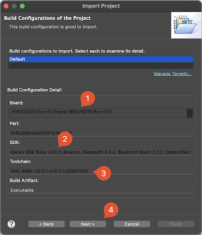
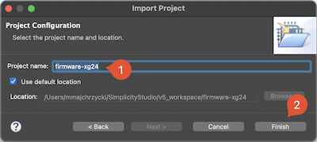
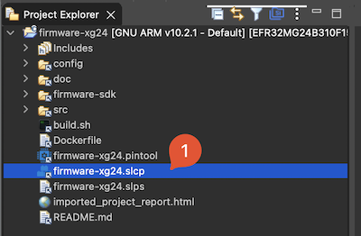
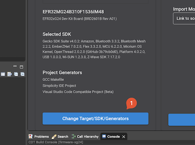
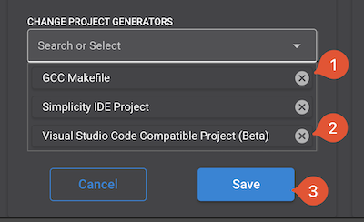

# Edge Impulse firmware for SiLabs Thunderboard Sense 2

[Edge Impulse](https://www.edgeimpulse.com) enables developers to create the next generation of intelligent device solutions with embedded Machine Learning. This repository contains the Edge Impulse firmware for the Silicon Labs Thunderboard Sense 2 development board. This device supports all Edge Impulse device features, including ingestion, remote management and inferencing.

> **Note:** Do you just want to use this development board with Edge Impulse? No need to build this firmware. See the instructions [here](https://docs.edgeimpulse.com/docs/development-platforms/officially-supported-mcu-targets/silabs-thunderboard-sense-2) for a prebuilt image and instructions.

This firmware has a [BLE capabilities](https://docs.edgeimpulse.com/docs/development-platforms/officially-supported-mcu-targets/silabs-thunderboard-sense-2#bluetooth-demo) built-in that allow you to start/stop inference and see its results on the mobile phone.

## Source code organization

* If you want to deploy your model (exported as a `Simplicity Studio Component` from Studio), extract the exported `zip` file content into:

    `extension`

### Reporting issues

This repository is a snapshot of the Edge Impulse internal code base, therefore PRs won't be merged. If you find any bugs or want to contribute use our [Developer Forum](https://forum.edgeimpulse.com/) to submit them.

## Requirements

### Hardware

* SiLabs Thunderboard Sense 2 development board ([documentation](https://www.silabs.com/documents/public/user-guides/ug309-sltb004a-user-guide.pdf))
> :warning: This board is **Not recommended for new designs**. For a replacement, see the [EFR32xG24 Dev Kit](https://www.silabs.com/development-tools/wireless/efr32xg24-dev-kit) :warning:

### Software

For a local build using command line tools:
* [SLC CLI Tools](https://www.silabs.com/documents/public/user-guides/ug520-software-project-generation-configuration-with-slc-cli.pdf)
* [GNU Arm Embedded Toolchain 10-2020-q4-major](https://developer.arm.com/tools-and-software/open-source-software/developer-tools/gnu-toolchain/gnu-rm/downloads)
* [Gecko SDK v4.0.2](https://github.com/SiliconLabs/gecko_sdk/tree/v4.0.2)

For build using Docker container:
* [Docker Desktop](https://www.docker.com/products/docker-desktop)

For build using Simplicity Studio v5:
* [Simplicity Studio 5](https://www.silabs.com/developers/simplicity-studio) with Gecko SDK 4.0.2

## How to build

### Local build using command line tools

1. Clone the [Gecko SDK v.4.0.2](https://github.com/SiliconLabs/gecko_sdk/tree/v4.0.2)

    ```
    git clone -b v4.0.2 https://github.com/SiliconLabs/gecko_sdk.git
    ```

1. Install [SLC CLI Tools (see p. 2.1)](https://www.silabs.com/documents/public/user-guides/ug520-software-project-generation-configuration-with-slc-cli.pdf)
1. Configure `SLC CLI` to point the location of the `Gecko SDK` and sign the SDK

    ```
    slc configuration --sdk /home/user/gecko_sdk/
    slc signature trust --sdk /home/user/gecko_sdk/
    ```

1. Also configure the default location of your toolchain, eg.

    ```
    slc configuration --gcc-toolchain /opt/toolchains/gcc-arm-none-eabi-10-2020-q4-major
    ```

1. Clone this repository and build

    ```
    git clone git@github.com:edgeimpulse/firmware-silabs-thunderboard-sense-2.git
    cd firmware-silabs-thunderboard-sense-2/
    ./build.sh --build
    ```

### Using Docker

1. Clone this repository

    ```
    git clone git@github.com:edgeimpulse/firmware-silabs-thunderboard-sense-2.git
    cd firmware-silabs-thunderboard-sense-2/
    ```

1. Build the container

    ```
    $ docker build -t edge-impulse-silabs .
    ```

1. Build the application

    ```
    docker run --rm -v $PWD:/app edge-impulse-silabs /bin/bash build.sh --build
    ```

### Using Simplicity Studio v5

1. Install [Simplicity Studio v5](https://www.silabs.com/developers/simplicity-studio) and [Gecko SDK v4.0.2](https://github.com/SiliconLabs/gecko_sdk)
1. Clone this repository
1. In the Simplicity Studio, choose `File -> Import`

    

1. Browse to the directory with cloned repository select `firmware-tunderboard-sense-2` project and clik `Next`

    

1. Check if all imported configurations are correct, especially `Board`, `SDK` and `Toolchain`:

    

1. Choose a project name in your workspace and finish

    

1. We have to make a few tweaks before building the project. In the `Project Explorer` panel, right click on the `extension` directory and choose `Delete`

    

1. Confirm that only workspace link will be removed, the target will remain unchanged

    

1. Now, double click on the `firmware-xg24.slcp` file to open project configuration

    

1. In the new window choose `Change Targed/SDK/Generators`

    

1. Make sure only `Simplicity IDE Project` generator is selected, **REMOVE** any other generators.

    

1. Build the project

    

## How to flash the board

You can either drag `./build/debug/firmware-silabs-thunderboard-sense-2.bin` to the `TB004` mass-storage device (mounts as a USB flash drive), or flash with the [Simplicity Commander](https://community.silabs.com/s/article/simplicity-commander?language=en_US) tool via:

    ```
    $ ./build.sh --flash
    ```
